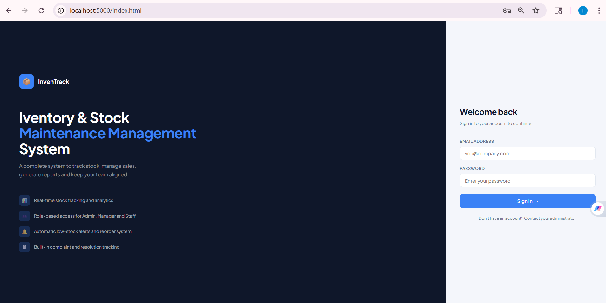

# 📦 InvenTrack — Automated Inventory & Stock Management System


A full-stack inventory and stock management system built with **Node.js**, **Express**, and **MongoDB**. Designed to automate inventory tracking, reduce manual errors, manage multi-role users, and provide real-time analytics — all through a modern, responsive web interface.

---

## 📋 Table of Contents

- [Features](#-features)
- [Tech Stack](#-tech-stack)
- [Project Structure](#-project-structure)
- [Prerequisites](#-prerequisites)
- [Installation](#-installation)
- [Environment Variables](#-environment-variables)
- [Running the Project](#-running-the-project)
- [User Roles & Permissions](#-user-roles--permissions)
- [API Endpoints](#-api-endpoints)
- [Screenshots](#-screenshots)
- [Objectives Achieved](#-objectives-achieved)
- [Future Improvements](#-future-improvements)
- [License](#-license)

---

## ✨ Features

### Core Inventory Management
- **Real-time stock tracking** — stock updates instantly on every sale or purchase
- **Product CRUD** — add, edit, delete products with name, category, quantity, price, reorder level, expiry date
- **Category normalization** — "office supplies" and "Office Supplies" are treated as the same category
- **Bulk CSV import** — import thousands of products from a CSV file
- **Low-stock alerts** — automatic detection of products at or below reorder level

### Sales & Purchase Management
- **Record sales** — deducts stock automatically, prevents overselling
- **Record purchases** — increases stock automatically
- **Stock impact preview** — shows current and projected stock before confirming a purchase
- **Full transaction history** — view all sales and purchases with timestamps and user info

### Reports & Analytics
- **6 interactive charts** — revenue vs cost, stock by category (pie), sales trend, top products, low stock, inventory value
- **Period-based reports** — daily, weekly, monthly, quarterly, yearly sales breakdowns
- **Inventory valuation** — total value by category with percentage share
- **Manager report logs** — admin can see which manager generated which report and when
- **Print/export** — one-click print for any report

### Complaint Management System
- **File complaints** — any staff or manager can raise a complaint with title, category, and priority
- **10-day resolution deadline** — automatic deadline tracking with overdue alerts
- **Admin/Manager response** — respond to complaints and update status (open → in progress → resolved)
- **Status tracking** — filter by open, in progress, resolved, or overdue

### User Management (Admin)
- **Create users** with role assignment (Admin, Manager, Staff)
- **Reset passwords** for any user
- **Set monthly salary** per user
- **Activate/Deactivate** accounts — deactivated users cannot login
- **Change roles** for non-admin users

### User Profiles
- **Edit personal info** — name, email, address, phone, department
- **Change password** with current password verification
- **Upload avatar** — profile picture stored as base64
- **View salary** and personal activity stats (sales count, revenue)

### Security
- **JWT authentication** on all API routes
- **Role-based access control** enforced at the API level
- **Deactivated user blocking** — token rejected if account is inactive

---

## 🛠 Tech Stack

| Layer | Technology |
|---|---|
| **Runtime** | Node.js v24+ |
| **Framework** | Express v5 |
| **Database** | MongoDB (local) |
| **ODM** | Mongoose |
| **Authentication** | JSON Web Tokens (JWT) |
| **Password Hashing** | bcryptjs |
| **Frontend** | Vanilla HTML, CSS, JavaScript |
| **Charts** | Chart.js v4.4 |
| **Fonts** | Google Fonts (Plus Jakarta Sans) |
| **CSV Parsing** | csv-parser |

---

## 📁 Project Structure

```
inventory-system/
├── server/
│   ├── config/
│   │   └── db.js                  # MongoDB connection
│   ├── controllers/
│   │   ├── authController.js      # Login & register
│   │   ├── productController.js   # Product CRUD
│   │   ├── saleController.js      # Sales recording
│   │   ├── purchaseController.js  # Purchase recording
│   │   ├── reportController.js    # Reports & analytics
│   │   ├── userController.js      # User management
│   │   ├── profileController.js   # Profile management
│   │   └── complaintController.js # Complaint system
│   ├── middleware/
│   │   └── auth.js                # JWT & role middleware
│   ├── models/
│   │   ├── User.js                # User schema
│   │   ├── Product.js             # Product schema
│   │   ├── Sale.js                # Sale schema
│   │   ├── Purchase.js            # Purchase schema
│   │   └── Supplier.js            # Supplier schema
│   ├── routes/
│   │   ├── authRoutes.js
│   │   ├── productRoutes.js
│   │   ├── saleRoutes.js
│   │   ├── purchaseRoutes.js
│   │   ├── reportRoutes.js
│   │   ├── userRoutes.js
│   │   ├── profileRoutes.js
│   │   └── complaintRoutes.js
│   └── server.js                  # App entry point
├── public/
│   ├── css/
│   │   └── style.css              # Full design system
│   ├── js/
│   │   ├── sidebar.js             # Shared sidebar & auth
│   │   ├── dashboard.js
│   │   ├── products.js
│   │   ├── sales.js
│   │   ├── purchases.js
│   │   ├── reports.js
│   │   ├── alerts.js
│   │   ├── users.js
│   │   ├── complaints.js
│   │   └── profile.js
│   ├── index.html                 # Login page
│   ├── dashboard.html             # Home / dashboard
│   ├── products.html
│   ├── sales.html
│   ├── purchases.html
│   ├── reports.html
│   ├── alerts.html
│   ├── users.html
│   ├── complaints.html
│   └── profile.html
├── importCSV.js                   # Bulk product import script
├── importSales.js                 # Bulk sales import script
├── createAdmin.js                 # First-time admin setup
├── fixDB.js                       # DB maintenance utility
├── .env                           # Environment variables
└── package.json
```

---

## ✅ Prerequisites

Make sure you have the following installed:

- [Node.js](https://nodejs.org/) v18 or higher
- [MongoDB](https://www.mongodb.com/try/download/community) (Community Edition, running locally)
- [Git](https://git-scm.com/)

Verify installations:

```bash
node -v
mongod --version
```

---

## 🚀 Installation

**1. Clone the repository**

```bash
git clone https://github.com/your-username/inventory-system.git
cd inventory-system
```

**2. Install dependencies**

```bash
npm install
```

**3. Set up environment variables**

Create a `.env` file in the root directory:

```bash
cp .env.example .env
```

Then edit `.env` with your values (see [Environment Variables](#-environment-variables)).

**4. Start MongoDB**

Make sure MongoDB is running on your machine:

```bash
# Windows (run in a separate terminal)
mongod

# macOS/Linux
sudo systemctl start mongod
```

**5. Create the first admin account**

```bash
node createAdmin.js
```

This creates:
- **Email:** `admin@example.com`
- **Password:** `admin123`

> ⚠️ Change this password immediately after first login via the Profile page.

**6. (Optional) Import sample data**

```bash
# Import products from CSV
node importCSV.js

# Import historical sales data
node importSales.js
```

---

## 🔧 Environment Variables

Create a `.env` file in the root with the following:

```env
PORT=5000
MONGO_URI=mongodb://localhost:27017/inventory_db
JWT_SECRET=your_super_secret_key_change_this_in_production
```

| Variable | Description | Default |
|---|---|---|
| `PORT` | Server port | `5000` |
| `MONGO_URI` | MongoDB connection string | `mongodb://localhost:27017/inventory_db` |
| `JWT_SECRET` | Secret key for JWT signing | — (required) |

> ⚠️ Never commit your `.env` file. It is already in `.gitignore`.

---

## ▶️ Running the Project

**Development:**

```bash
node server/server.js
```

**With auto-restart (install nodemon first):**

```bash
npm install -g nodemon
nodemon server/server.js
```

Open your browser at:

```
http://localhost:5000
```

---

## 👥 User Roles & Permissions

| Feature | Admin | Manager | Staff |
|---|---|---|---|
| View Dashboard | ✅ Full stats | ✅ Full stats | ✅ Quick sale only |
| Manage Products | ✅ Add/Edit/Delete | ✅ Add/Edit/Delete | 👁 View only |
| Record Sales | ✅ | ❌ | ✅ |
| View Sales | ✅ | ✅ | ✅ Own sales |
| Record Purchases | ✅ | ✅ | ❌ |
| View Reports | ✅ All tabs + Manager Logs | ✅ Overview + Period + Inventory | ❌ |
| Period Reports | ✅ Daily/Weekly/Monthly/Quarterly/Yearly | ✅ Same | ❌ |
| Stock Alerts | ✅ | ✅ | ❌ |
| Reorder Stock | ✅ | ✅ | ❌ |
| File Complaints | ✅ | ✅ | ✅ |
| Respond to Complaints | ✅ | ✅ | ❌ |
| User Management | ✅ | ❌ | ❌ |
| Activate/Deactivate Users | ✅ | ❌ | ❌ |
| Reset User Passwords | ✅ | ❌ | ❌ |
| Set Salaries | ✅ | ❌ | ❌ |
| View Manager Logs | ✅ | ❌ | ❌ |
| Edit Own Profile | ✅ | ✅ | ✅ |

---

## 🔌 API Endpoints

### Authentication
| Method | Endpoint | Description |
|---|---|---|
| POST | `/api/auth/register` | Register new user |
| POST | `/api/auth/login` | Login and receive JWT |

### Products
| Method | Endpoint | Auth | Description |
|---|---|---|---|
| GET | `/api/products` | All | Get all products |
| GET | `/api/products/lowstock` | All | Get low-stock products |
| GET | `/api/products/:id` | All | Get single product |
| POST | `/api/products` | Admin/Manager | Create product |
| PUT | `/api/products/:id` | Admin/Manager | Update product |
| DELETE | `/api/products/:id` | Admin/Manager | Delete product |

### Sales
| Method | Endpoint | Auth | Description |
|---|---|---|---|
| GET | `/api/sales` | All | Get all sales |
| POST | `/api/sales` | All | Record a sale |

### Purchases
| Method | Endpoint | Auth | Description |
|---|---|---|---|
| GET | `/api/purchases` | Admin/Manager | Get all purchases |
| POST | `/api/purchases` | Admin/Manager | Record a purchase |

### Reports
| Method | Endpoint | Auth | Description |
|---|---|---|---|
| GET | `/api/reports/inventory` | Admin/Manager | Inventory summary |
| GET | `/api/reports/sales` | Admin/Manager | Sales summary |
| GET | `/api/reports/purchases` | Admin/Manager | Purchase summary |
| GET | `/api/reports/sales/period?period=weekly` | Admin/Manager | Period sales report |
| GET | `/api/reports/manager-reports` | Admin only | Manager report logs |

### Users (Admin only)
| Method | Endpoint | Description |
|---|---|---|
| GET | `/api/users` | Get all users |
| DELETE | `/api/users/:id` | Delete user |
| PUT | `/api/users/:id/role` | Change user role |
| PUT | `/api/users/:id/password` | Reset password |
| PUT | `/api/users/:id/salary` | Update salary |
| PUT | `/api/users/:id/toggle` | Activate/deactivate |

### Profile
| Method | Endpoint | Auth | Description |
|---|---|---|---|
| GET | `/api/profile` | All | Get own profile |
| PUT | `/api/profile` | All | Update own profile |
| PUT | `/api/profile/password` | All | Change own password |

### Complaints
| Method | Endpoint | Auth | Description |
|---|---|---|---|
| GET | `/api/complaints` | All | Get complaints |
| POST | `/api/complaints` | All | File a complaint |
| PUT | `/api/complaints/:id/respond` | Admin/Manager | Respond to complaint |

---

## 🎯 Objectives Achieved

| # | Objective | Status |
|---|---|---|
| 1 | Automate inventory management | ✅ Full CRUD, CSV import, electronic records |
| 2 | Track stock levels in real time | ✅ Auto-update on every sale/purchase |
| 3 | Manage product information efficiently | ✅ Name, category, qty, price, expiry, supplier |
| 4 | Improve stock control and planning | ✅ Analytics, trend charts, category breakdown |
| 5 | Generate reports and analytics | ✅ 6 charts, period reports, print export |
| 6 | Support multiple users with roles | ✅ Admin, Manager, Staff with JWT auth |
| 7 | Ensure timely replenishment | ✅ Low-stock alerts, reorder workflow |
| 8 | Integrate sales and purchase management | ✅ Auto stock deduction/increase |
| 9 | Enhance operational efficiency | ✅ Search, bulk import, complaint system |

---

## 🔮 Future Improvements

- [ ] Email notifications for low-stock alerts and complaint deadlines
- [ ] Barcode/QR code scanning for products
- [ ] PDF export for reports
- [ ] Multi-warehouse support
- [ ] Supplier management portal
- [ ] Mobile app (React Native)
- [ ] Real-time updates using WebSockets
- [ ] Automated reorder emails to suppliers
- [ ] Advanced forecasting using sales trends

---

## 🐛 Known Issues

- The yearly sales period report may show limited data if historical sales were not imported from CSV
- Avatar images are stored as base64 in MongoDB; for production, consider cloud storage (AWS S3, Cloudinary)

---

## 📄 License

This project is licensed under the **ISC License**.

---

## 🙌 Acknowledgements

- [Chart.js](https://www.chartjs.org/) for interactive charts
- [MongoDB](https://www.mongodb.com/) for the database
- [Express](https://expressjs.com/) for the web framework
- [Google Fonts](https://fonts.google.com/) for Plus Jakarta Sans

---

> Built as a complete inventory management solution covering all aspects from stock tracking to team management and analytics.
